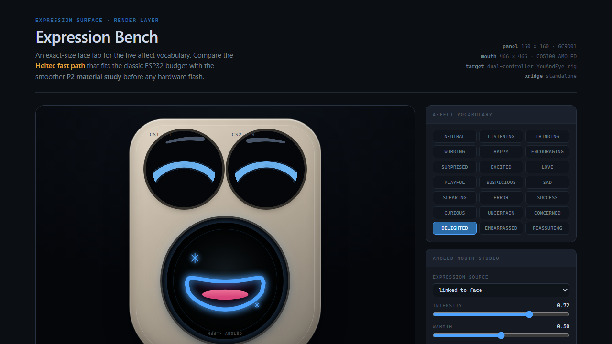
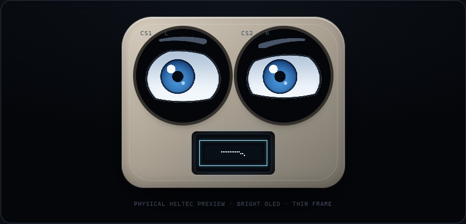
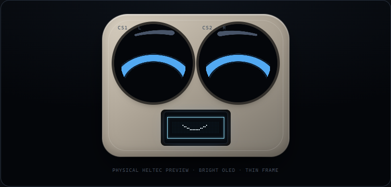
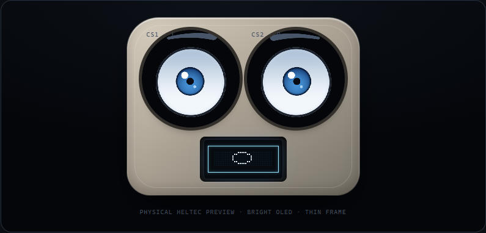
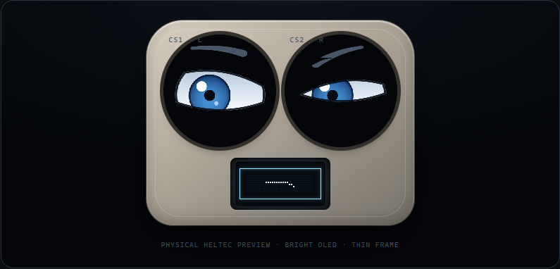
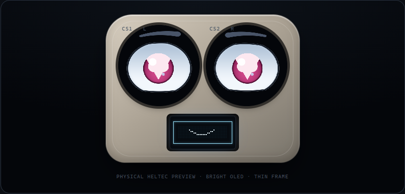
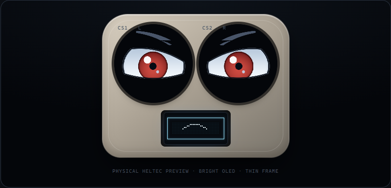

<div align="center">

# YouAndEye 👀

### A tiny DIY face for an AI with something to say

Two little IPS eyes, a pocket-size OLED or lush round AMOLED mouth, and a pair of ESP32s doing their best
impression of being alive.




**[Build one](docs/DIY_BUILD_GUIDE.md)** · **[Meet the face API](docs/MCP.md)** ·
**[Open the expression bench](simulator/index.html)**

</div>

## Hello, little face

YouAndEye is an expressive physical face for local or cloud-connected AI agents. The agent says *what it
means*—happy, thinking, suspicious, listening—and the device decides how to perform it: eye shape, brows,
gaze, blink timing, mouth motion, text, and small character beats.

The face does not need a stream of animation frames from a computer. Once powered, it keeps breathing,
looking around, and blinking locally. Disconnect the agent and it still has a pulse.

## Meet the expressions

The browser bench renders the same semantic poses used by the firmware. Its mouth-hardware switch compares
the original 128×64 OLED with the optional 466×466 round AMOLED head before either device is flashed. The
AMOLED mouth studio can isolate every affect and tune bounded intensity, warmth, confidence, and urgency.

| Thinking | Happy |
|:---:|:---:|
|  |  |
| **Surprised** | **Suspicious** |
|  |  |
| **Love** | **Error** |
|  |  |

## What is inside?

| Part | Job |
|---|---|
| Classic Heltec WiFi Kit 32 | Runs both eye panels; its built-in OLED is the compact mouth and automatic fallback |
| Waveshare 0.71-inch DualEye LCD | Two 160×160 GC9D01 round IPS eyes on one compact board |
| Optional Waveshare ESP32-S3-Touch-AMOLED-1.75 | Separate 466×466 CO5300 mouth with 21 authored expressions, captions, icons, and local choreography |
| `firmware/` | Twenty-one eye expressions, autonomous motion, synchronized beats, and the OLED fallback |
| `firmware/amoled-mouth/` | USB-only semantic renderer for the optional round mouth |
| Expression Bench | Exact-size browser playground for tuning before flashing hardware |
| `emote/1` | Transport-independent semantic expression contract |
| Local MCP server | Semantic expression, local identities, and self-timed performances for Codex or another MCP client |

The accepted build sustains about 30 FPS on the classic ESP32 with synchronized blinking and zero deadline
misses in its final 60-second hardware soak. Release firmware is USB-only: it starts no access point, stores
no Wi-Fi credentials, and exposes no device network service.

## Build one over a weekend

The complete [DIY build guide](docs/DIY_BUILD_GUIDE.md) includes:

- exact board-generation warnings and official source links
- a shopping list and the proven 11-wire pin map
- careful first-power and upload steps
- eye, mouth, serial, and MCP smoke tests
- enclosure ideas and friendly failure recovery

The short version is delightfully small:

```text
                         ┌─ USB ─► classic Heltec ── SPI ─► two eyes
your agent ── local MCP ─┤
                         └─ USB ─► ESP32-S3 ── QSPI ─► round AMOLED mouth
```

The second controller is optional. If it is absent or fails its firmware-signature check, YouAndEye wakes
the Heltec OLED and continues as the original one-board face.

> [!IMPORTANT]
> Heltec's current WiFi Kit 32 is an ESP32-S3 revision. This working build uses the older classic ESP32
> target named `heltec_wifi_kit_32` by PlatformIO. Read the buying note before ordering.

## Try the software first

No hardware is required to explore the expressions:

```powershell
python -m http.server 4173
```

Open `http://127.0.0.1:4173/simulator/`, choose an expression, and watch the same
semantic motion model used by the firmware.

## Build and test

```powershell
uv sync --extra serial
uv run --extra serial python -m unittest discover -s tests -p 'test_*.py' -v
python -m platformio run -d firmware -e heltec_wifi_kit_32
python -m platformio run -d firmware/amoled-mouth -e waveshare_amoled_mouth
```

The firmware pins Espressif32 6.12.0 and carries a small, licensed Arduino GFX 1.6.4 subset containing
only the GC9D01 and ESP32 SPI code it uses. A fresh checkout therefore cannot silently pull incompatible
display code.

Hardware writes are deliberately separate from builds. The DIY guide walks through identifying the board
before supplying an upload port.

## Give the face a feeling

The preferred agent boundary is local STDIO MCP:

```text
express(affect="thinking", message="PLEASE WAIT...", text_mode="scroll")
express(affect="success", sequence="celebrate")
perform(beats=[{"affect":"listening","pace":"brief"}, {"affect":"thinking","pace":"held"}, {"affect":"delighted","pace":"brief"}])
neutral()
```

| Tool | Meaning |
|---|---|
| `express` | Show a temporary affect, message, or device-owned character beat |
| `face_status` | Read connection state, active expression, FPS, timing, and display health |
| `face_capabilities` | Discover the face without opening its serial port |
| `neutral` | Clear pending intent and return to autonomous neutral |
| `configure_profile` | Create, preview, approve, activate, revise, or reset this agent's local identity |
| `perform` | Run a complete semantic scene with surface-owned timing and completion feedback |

Each agent can choose a curated iris palette, accent, energy, blink/gaze style, idle temperament, mouth style,
and short signature acknowledgement. A new identity is previewed across neutral, listening, thinking, and
success and requires user approval before activation. Profiles live in the operating system's local user-data
directory, outside this repository.

See [the MCP guide](docs/MCP.md) for Codex setup, other MCP clients, the loopback-only HTTP bridge, and safety
behavior. The project is local-first and fully usable offline; a trusted desktop client can optionally make
the tools available to a cloud agent without turning the microcontroller into a public service.

## Design rules

- **Agents express intent. Surfaces perform it.** Models never receive raw pixel or keyframe controls.
- **Life belongs on the device.** Blinks, saccades, easing, and idle behavior survive host hiccups.
- **Simulator before solder.** Visual ideas graduate in the browser before reaching firmware.
- **Readable beats realistic.** Six core expressions must remain recognizable at actual eye size.
- **Fail softly.** Expired or interrupted host intent returns to an autonomous neutral face.

## Project map

| Path | What lives there |
|---|---|
| [`docs/DIY_BUILD_GUIDE.md`](docs/DIY_BUILD_GUIDE.md) | Parts, wiring, flashing, first boot, enclosure, and troubleshooting |
| [`simulator/`](simulator/) | Interactive expression and motion simulator |
| [`firmware/`](firmware/) | Accepted classic-ESP32 eye firmware and built-in OLED fallback |
| [`firmware/amoled-mouth/`](firmware/amoled-mouth/) | Optional Waveshare round-AMOLED mouth firmware |
| [`host/youandeye/`](host/youandeye/) | MCP, HTTP, arbitration, validation, and verified serial bridge |
| [`schema/`](schema/) | Canonical `emote/1` JSON schemas |
| [`docs/MCP.md`](docs/MCP.md) | Agent interface and client setup |
| [`STATUS.md`](STATUS.md) | Concise release status and verification evidence |

Engineers joining the project should begin with this README and [`ARCHITECTURE.md`](ARCHITECTURE.md). Humans
who just want a charming desk creature should begin with the [DIY guide](docs/DIY_BUILD_GUIDE.md).

## Known-good release

The current release provides twenty-one affects, intensity-scaled geometry, five coordinated
character beats, a full cartoony mouth actor, smooth text scrolling, native icons, and synchronized binocular blinking.
The round mouth distinguishes attention, thought, confidence, delight, concern, uncertainty, embarrassment,
playfulness, love, and error through silhouette before adding teeth, tongue, thought dots, blush, sweat, hearts,
sparkles, or alert marks. Its anticipation, moving holds, and six local speech visemes run without host keyframes.
Small device-owned cues add a thinking hesitation, listening attention lead, success relief, uncertainty gaze
aversion, restrained per-eye variation, and a slow neutral attention fade that resets with new intent. Its
paired host stack adds the local MCP/HTTP control plane, approval-gated per-agent identities, and self-timed
semantic scenes. Current build sizes, tests, physical-validation status, and limitations are recorded in
[`STATUS.md`](STATUS.md).

## Make it yours

Try a cardboard face. Sculpt one from foam clay. Put the eyes in a robot, a puppet, or a tiny haunted radio.
The protocol deliberately separates personality from hardware, so a completely different shell can keep the
same emotional vocabulary.


Please document the exact hardware you test, and share photos of anything especially adorable or unsettling.

YouAndEye is free software under the [MIT License](LICENSE). Dependency terms are collected in
[THIRD_PARTY_NOTICES.md](THIRD_PARTY_NOTICES.md).
