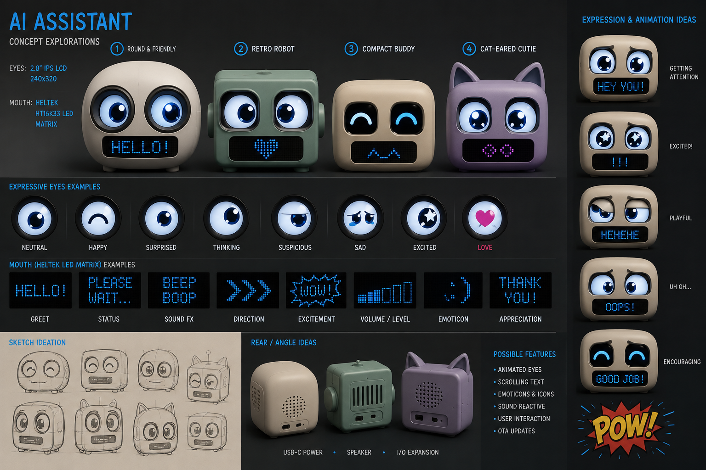

# Build your own YouAndEye

YouAndEye is a small, expressive desk face made from a classic ESP32, a pair of tiny round LCDs, and either
the OLED already attached to the controller or an optional high-resolution round AMOLED mouth. The eyes blink
and wander on their own; an AI agent only sends high-level intent such as “thinking,” “happy,” or “say hello.”

This guide recreates the **tested classic-ESP32 build**. Take your time, keep the USB cable unplugged while
wiring, and treat the first blink as a tiny victory. 👀



## Before you buy anything

The name **Heltec WiFi Kit 32** has been reused across hardware generations.

This repository's working firmware targets the legacy/classic board recognized by PlatformIO as
`heltec_wifi_kit_32`: an original ESP32, 240 MHz, 4 MB flash board with a built-in 128×64 OLED. The tested
unit reports an ESP32-D0WDQ6-V3. Heltec's current product documentation describes a newer ESP32-S3FN8
revision; that newer board is **not a drop-in replacement** for this recipe.

Before purchasing, confirm the board photos, chip family, pinout, and PlatformIO target with the seller. If
you can only find the current S3 model, consider that a firmware-porting project rather than this build.

References:

- [PlatformIO: classic Heltec WiFi Kit 32](https://docs.platformio.org/en/latest/boards/espressif32/heltec_wifi_kit_32.html)
- [Heltec: current WiFi Kit 32 documentation](https://docs.heltec.org/en/node/esp32/wifi_kit_32/index.html)
- [Waveshare: 0.71-inch DualEye LCD product (SKU 29381)](https://www.waveshare.com/0.71inch-DualEye-LCD-Module.htm)
- [Waveshare: DualEye LCD wiki and datasheet links](https://www.waveshare.com/wiki/0.71inch_DualEye_LCD_Module)

## Parts

| Qty | Part | What to look for |
|---:|---|---|
| 1 | Legacy Heltec WiFi Kit 32 | Classic ESP32, built-in 0.96-inch 128×64 OLED, PlatformIO ID `heltec_wifi_kit_32` |
| 1 | Waveshare 0.71-inch DualEye LCD Module | SKU 29381, two 160×160 IPS panels, GC9D01, 11-pin SH1.0 connector |
| 1 | Matching 11-pin SH1.0 cable or breakout | Confirm the seller's package contents; never infer signals from wire colors |
| 1 | USB data cable | It must carry data, not power only |
| 1 set | Jumper wire, solder, or a small protoboard | Use whichever gives every connection strain relief |
| 1 | Non-conductive enclosure | A printed shell, foamboard, polymer clay, or a gloriously temporary blob all work |
| optional | Heat-shrink, foam tape, hot glue | For insulation and mechanical support after testing |
| optional | Waveshare ESP32-S3-Touch-AMOLED-1.75 | A separate 466×466 CO5300 round mouth with its own USB data cable |

Useful tools are a fine-tip soldering iron, flush cutters, tweezers, and a multimeter with continuity mode.
The eye module accepts 3.3 V or 5 V power according to Waveshare; the proven build uses **3.3 V**. ESP32 GPIO
signals are 3.3 V logic and must never receive 5 V.

## Wiring

Both eyes share the SPI data, clock, and data/command lines. Each panel gets its own chip-select, reset, and
backlight line. The built-in OLED keeps its dedicated I²C pins.

| DualEye pin | Heltec pin | Purpose |
|---|---:|---|
| `VCC` | `3V3` | Display power |
| `GND` | `GND` | Common ground |
| `DIN` | GPIO 23 | SPI MOSI |
| `CLK` | GPIO 18 | SPI clock |
| `CS1` | GPIO 5 | Left-eye chip select |
| `CS2` | GPIO 17 | Right-eye chip select |
| `DC` | GPIO 21 | Shared data/command |
| `RST1` | GPIO 22 | Left-eye reset |
| `RST2` | GPIO 19 | Right-eye reset |
| `BL1` | GPIO 25 | Left backlight |
| `BL2` | GPIO 26 | Right backlight |

The Heltec's built-in OLED uses GPIO 4 for SDA, GPIO 15 for SCL, and GPIO 16 for reset. Leave those pins
alone. The firmware drives the eye bus at the tested 40 MHz setting.

### Safe wiring order

1. Unplug USB and any battery.
2. Find pin 1 and read the labels on the module or official pinout. Do not trust cable colors.
3. Connect `GND`, then `3V3`, then the shared SPI signals, then the per-eye control lines.
4. Check for a short between `3V3` and `GND` with a multimeter.
5. Check every connection against the table a second time.
6. Power from USB only for the first test. Add batteries or a permanent supply later.

If your physical left and right eyes are exchanged, fix the connector mapping or use the runtime diagnostics;
do not “fix” expression geometry to compensate for wiring.

## Software setup

Install:

- [Git](https://git-scm.com/downloads)
- [Python 3.11 or newer](https://www.python.org/downloads/)
- [PlatformIO Core](https://docs.platformio.org/en/latest/core/installation/index.html)
- [`uv`](https://docs.astral.sh/uv/getting-started/installation/) for the local host and MCP tools
- On Windows, the [Silicon Labs CP210x VCP driver](https://www.silabs.com/developers/usb-to-uart-bridge-vcp-drivers)

Clone the repository and prepare the host environment:

```powershell
git clone <REPOSITORY_URL>
cd YouAndEye
uv sync --extra serial
```

Build the firmware without touching hardware:

```powershell
python -m platformio run -d firmware -e heltec_wifi_kit_32
```

The PlatformIO project pins Espressif32 6.12.0 and includes the small Arduino GFX 1.6.4 subset used by
the GC9D01 eyes, so it does not guess a different display stack on a fresh machine.

For the optional round mouth, build its independent image too:

```powershell
python -m platformio run -d firmware/amoled-mouth -e waveshare_amoled_mouth
```

The AMOLED project uses the ESP32-S3's 8 MB PSRAM and native USB but does not start Wi-Fi or initialize the
board's touch, microphone, speaker, or sensors. Its board and display configuration follows the
[official Waveshare ESP32-S3-Touch-AMOLED-1.75 documentation](https://docs.waveshare.com/ESP32-S3-Touch-AMOLED-1.75).

## Identify, then flash

Never copy a COM port from a screenshot or this guide. List the ports on the computer in front of you:

```powershell
uv run --extra serial python -m serial.tools.list_ports -v
```

The tested USB bridge reports VID:PID `10C4:EA60` and a Silicon Labs CP210x description. Confirm that the
connected board is the classic ESP32 target, substitute its current port below, and only then upload:

```powershell
python -m platformio run -d firmware -e heltec_wifi_kit_32 `
  --target upload --upload-port <PORT>
```

On Linux or macOS the port will look more like `/dev/ttyUSB0` or `/dev/cu.SLAB_USBtoUART`. If automatic
reset fails, hold the board's `PRG`/`BOOT` button, tap `RST`, release `PRG`, and retry.

### Add the round mouth

Connect the AMOLED board with its own data-capable USB cable. It normally enumerates as Espressif native USB
with VID:PID `303A:1001`; confirm that identity and that it is the only matching board before uploading:

```powershell
python -m platformio run -d firmware/amoled-mouth -e waveshare_amoled_mouth `
  --target upload --upload-port <AMOLED_PORT>
```

No signal wires run between the two controllers. The host synchronizes them semantically over their two USB
connections. On first boot the AMOLED should show a calm blue mouth. A serial `STATUS` request must include
`product=youandeye-mouth display=co5300 size=466x466`. The host will not drive a native-USB board that does
not return that signature.

## First hello

Open the serial monitor at 115200 baud:

```powershell
python -m platformio device monitor --port <PORT> --baud 115200
```

You should see `Agent Eye Runtime Ready`. Send these lines one at a time:

```text
STATUS
DISPLAY TEST
DISPLAY LIVE
EMOTE HAPPY
TEXT HELLO!
MOUTH AUTO
BEAT SUCCESS
EMOTE NEUTRAL
```

Expected behavior:

- `DISPLAY TEST` lights both eye paths; `DISPLAY LIVE` returns to the animated renderer.
- `EMOTE HAPPY` changes both eyes while keeping autonomous blink and gaze motion.
- `TEXT HELLO!` temporarily uses the OLED as a text panel.
- `MOUTH AUTO` restores the affect-driven mouth.
- `BEAT SUCCESS` performs a synchronized eye-and-mouth character beat.

With the optional round mouth connected, `face_status` reports `dual_controller_amoled`, the same calls drive
the new panel, and the small OLED turns off. Unplugging or disabling the AMOLED makes the OLED the mouth again.

If a screen is physically upside down, use `ORIENT <left 0..3> <right 0..3>` to diagnose the mounting before
changing the defaults. The accepted side-by-side assembly uses rotations `1,3`.

## Let an agent wear the face

Close the serial monitor first; only one process can own the port. Then run the real MCP smoke test:

```powershell
uv run --extra serial python tools/smoke_mcp.py --port auto --amoled-port auto --exercise
```

That discovers the approved board, reads live telemetry, shows one celebration, and explicitly returns the
face to neutral. Configure your MCP client with the command in [MCP.md](MCP.md). The original four tools are:

- `express` — show a temporary affect, message, or coordinated beat
- `face_status` — inspect the face and live render health
- `face_capabilities` — discover what this build supports
- `neutral` — clear host intent and return to the autonomous resting face

Two compatible additions, `configure_profile` and `perform`, add approval-gated identity and complete
self-timed scenes without changing those original calls.

Read [MCP.md](MCP.md) for the complete interface. The design is local-first and works fully offline. A trusted
desktop agent may proxy these tools to a cloud session, but the serial device is never exposed as a public
network service by this project.

## Give it a face

Electronics are only half the character. A few enclosure tips make a surprising difference:

- Mount the round panels level and at the same depth. Small alignment errors read as a permanent expression.
- Leave a soft dark rim around each LCD to hide its square corners and increase apparent contrast.
- Place the Heltec OLED low enough to read as a mouth, but leave access to USB, `PRG`, and `RST`.
- If you use the round mouth, leave a dark circular rim around it. The black AMOLED background disappears into
  that bezel, so the glowing curve reads like a floating expression instead of a screen.
- Leave access to both USB connectors. They are independent controllers and both need data-capable cables.
- Add strain relief before closing the shell. The tiny SH1.0 connector should not carry cable tension.
- Keep metal, wet clay, and conductive paint away from powered electronics.
- Start with cardboard, foam, or reusable putty. The best final enclosure usually follows one wonderfully
  awkward prototype.

## Troubleshooting

| Symptom | Check |
|---|---|
| Board does not appear | Data-capable USB cable, CP210x driver, another USB port, Device Manager or `list_ports` |
| Upload will not start | Correct classic board target and port; use the `PRG` + `RST` bootloader sequence |
| Both eyes are black | Confirm 3.3 V/GND, `DIN`, `CLK`, and `DC`; run `DISPLAY TEST` |
| Only one eye works | Check that `CS1/CS2`, `RST1/RST2`, and `BL1/BL2` are not swapped or shorted |
| Eye is upside down | Use `ORIENT`; verify the physical module orientation before editing firmware |
| OLED is blank | Keep GPIO 4/15/16 free; request `MOUTH STATUS`, then `MOUTH AUTO` |
| OLED is blank while AMOLED works | Expected: the host puts the fallback OLED into hardware sleep |
| AMOLED is blank | Confirm its native-USB identity, request `STATUS`, and require the `youandeye-mouth` signature |
| Face shakes or disappears | Confirm the current repository firmware, 40 MHz SPI baseline, and stable USB power |
| MCP cannot connect | Close serial monitors; confirm exactly one approved CP210x device; call `face_status` |

## A gentle stopping point

Once both eyes stay visible, blink together, the OLED mouth reacts, and the smoke test returns to neutral,
you are done. Enjoy the little face for a while before tuning it. Character is easier to judge across a desk
than through a benchmark.

When you are ready to modify it, use the browser Expression Bench first and flash second. That habit keeps
the fun iterations quick and the hardware recoverable.
